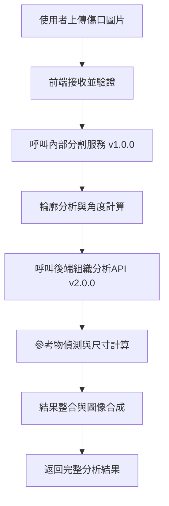

# 傷口辨識系統 - Docker Compose 重構版本

## 📋 專案概述

本專案是針對傷口辨識系統的**部署架構重構**，**核心演算法完全保持不變**，主要解決了原有部署方式的複雜性和維護困難問題。

### 🎯 重構目標
- **統一部署管理**：從手動容器操作改為 Docker Compose 一鍵部署
- **網路架構優化**：減少對外暴露端口，提升安全性
- **維護性提升**：標準化配置，降低運維複雜度
- **擴展性增強**：為未來功能擴展提供良好基礎

## 🏗️ 部署方式對比

### ❌ 重構前的問題
```bash
# 舊部署方式
🔧 前端服務：使用 Dockerfile，對外開放 port 8326
🔧 後端服務：使用空 Docker 容器 + 手動 docker exec 執行 Python 腳本，開放 port 8327
🔧 分割服務：外部獨立服務，對外開放 port 8019
🚫 問題點：
   - 需要手動管理三個獨立服務
   - 對外開放三個端口（安全風險）
   - 分割服務依賴外部機器（74號電腦），容易因為重開機或跳電而服務中斷
   - 服務間通訊依賴外部網路
   - 部署步驟複雜，容易出錯
   - 難以進行統一的日誌管理和監控
```

### ✅ 重構後的解決方案
```bash
# 新的 Docker Compose 部署方式
🎯 前端服務 (frontend)：YOLOv4 Flask API，對外暴露 port 8326
🎯 後端服務 (backend)：組織分析 API，僅在內部網路通訊
🎯 分割服務 (segmentation)：傷口分割 API，僅在內部網路通訊
🚀 統一管理：使用 Docker Compose 管理三個服務
🔒 安全通訊：前端透過內部網路調用後端（backend:8327）和分割（segmentation:8019）服務
📦 一鍵部署：docker-compose up -d (還可以附帶 restart)
🎯 完全內化：所有服務都在本地運行，不再依賴外部機器
```

### 🔄 架構改進對比

| 項目 | 重構前 | 重構後 |
|------|--------|--------|
| **部署方式** | 手動 docker run + exec + 外部服務 | `docker-compose up -d` |
| **對外端口** | 8326 + 8327 + 8019 | 僅 8326 |
| **服務數量** | 3個獨立服務 | 3個容器統一管理 |
| **服務通訊** | 外部 IP 通訊 | 內部網路通訊 |
| **分割服務** | 依賴外部機器（74號） | 完全內化，本地運行 |
| **配置管理** | 散落在各處 | 統一環境變數配置 |
| **依賴管理** | 手動啟動順序 | 自動依賴解析 |
| **健康檢查** | 無 | 內建健康檢查機制 |
| **日誌管理** | 分散查看 | 統一日誌管理 |
| **容錯能力** | 外部服務易中斷 | 本地服務高可用 |

## 🚀 快速開始

### 前置需求
- Docker >= 20.0
- Docker Compose >= 2.0
- 至少 16GB RAM（用於深度學習模型）
- NVIDIA GPU 支援（建議）

### 一鍵部署
```bash
cd wound_fullend
docker-compose up -d
```

### 服務管理
```bash
# 檢查服務狀態
docker-compose ps

# 查看服務日誌
docker-compose logs frontend
docker-compose logs backend
docker-compose logs segmentation
docker-compose logs -f  # 實時日誌

# 重啟服務
docker-compose restart

# 停止服務
docker-compose down

# 重新建置並啟動
docker-compose up --build -d
```

## 🔧 服務架構

### 前端服務 (Frontend) - `wound_frontend_container`
- **基於目錄**: `yolov4_flask_api_20240321v2/`
- **對外端口**: 8326
- **Dockerfile**: `Dockerfile`
- **主要功能**: 
  - 🖼️ 圖片上傳介面
  - 🔗 服務整合協調（調用分割和組織分析）
  - 🔍 傷口輪廓分析 (`mask.py`)
  - 📏 參考物件偵測 (`yolo_detection.py`)
  - 🎨 結果圖像合成 (`draw_results.py`)

### 分割服務 (Segmentation) - `wound_segmentation_container`
- **基於目錄**: `傷口輪廓/web/`
- **內部端口**: 8019（不對外暴露）
- **Dockerfile**: `Dockerfile`（**新建**）
- **主要功能**:
  - 🔍 傷口區域自動分割
  - 🎯 UNet 深度學習模型 (`best_unet_binary.pth`)
  - 🎨 分割結果視覺化（overlay 和 heatmap）
  - 📊 背景與傷口像素統計

### 後端服務 (Backend) - `wound_backend_container`
- **基於目錄**: `組織/`
- **內部端口**: 8327（不對外暴露）
- **Dockerfile**: `Dockerfile`（**新建**）
- **主要功能**:
  - 🧠 深度學習組織分割
  - 🌈 6通道分析（RGB + Lab）
  - 📊 組織比例計算
  - 🎯 精確的組織分類（肉芽、壞死、腐肉）

### 網路配置
- **內部網路**: `wound-network` (bridge)
- **服務發現**: 
  - 前端透過 `backend:8327` 訪問組織分析服務
  - 前端透過 `segmentation:8019` 訪問分割服務
- **安全性**: 分割和後端服務都不對外暴露，僅內部通訊

## 🌐 API 端點

### 前端 API（對外暴露）
```http
GET  http://ip:8326/health          # 健康檢查
GET  http://ip:8326/                # 主要介面
POST http://ip:8326/                # 圖片上傳與分析
GET  http://ip:8326/out/<filename>  # 結果圖片
GET  http://ip:8326/mask/<filename> # 分割遮罩
```

### 分割 API（內部使用）
```http
POST http://segmentation:8019/WoundService/api/v1.0.0/inference   # 傷口分割
GET  http://segmentation:8019/WoundService/api/v1.0.0/model_name  # 模型資訊
GET  http://segmentation:8019/tmp/<path:filename>                 # 結果下載
```

### 後端 API（內部使用）
```http
POST http://backend:8327/WoundService/api/v2.0.0/inference   # 組織分析
GET  http://backend:8327/WoundService/api/v2.0.0/model_name  # 模型資訊
GET  http://backend:8327/temp/<filename>                     # 結果下載
```

## 📊 完整處理流程



1. **圖片上傳**: 使用者透過前端上傳傷口圖片
2. **傷口分割**: 調用**內部分割服務** v1.0.0 進行基本傷口分割
3. **輪廓分析**: 分析分割結果，計算傷口輪廓和角度
4. **組織分析**: 調用**內部後端服務** v2.0.0 進行深度組織分類
5. **參考物偵測**: 偵測圓形參考物件，計算實際尺寸
6. **結果整合**: 整合所有分析結果並返回


## 📁 重構後的檔案結構

```
wound_fullend/
├── docker-compose.yml                    # 🆕 統一的容器編排配置
├── README.md                             # 📝 本檔案
├── 
├── yolov4_flask_api_20240321v2/          # 前端服務目錄
│   ├── Dockerfile.ubuntu16               # 前端容器配置
│   ├── web.py                            # 主程式 - Flask API
│   ├── mask.py                           # 輪廓分析模組
│   ├── tissue.py                         # 組織分析整合模組
│   ├── yolo_detection.py                 # 參考物偵測模組
│   ├── draw_results.py                   # 結果圖像合成模組
│   ├── requirements.txt                  # Python 依賴
│   └── [資料目錄] images/, out/, mask/, heatmap/, temp/
│
├── 傷口輪廓/web/                         # 🆕 分割服務目錄
│   ├── Dockerfile                        # 🆕 分割容器配置
│   ├── web.py                            # 傷口分割 API 服務
│   ├── requirements.txt                  # 🆕 Python 依賴定義
│   ├── best_unet_binary.pth              # UNet 模型權重 (181MB)
│   └── [資料目錄] tmp/Upload/, tmp/mask/
│
└── 組織/                                 # 後端服務目錄
    ├── Dockerfile                        # 🆕 後端容器配置
    ├── web.py                            # 組織分割 API 服務
    ├── requirements.txt                  # 🆕 Python 依賴定義
    ├── b5/b5.pth                         # 深度學習模型權重
    └── [資料目錄] temp/, heatmap/
```

## 🚧 故障排除

### 常見問題診斷

#### 1. 後端服務啟動失敗
```bash
# 檢查後端日誌
docker-compose logs backend
```

#### 2. 前端無法連接後端服務
```bash
# 檢查服務網路連通性
docker-compose exec frontend ping backend
docker-compose exec frontend ping segmentation

# 檢查後端健康狀態
docker-compose exec frontend curl http://backend:8327/WoundService/api/v2.0.0/model_name
docker-compose exec frontend curl http://segmentation:8019/WoundService/api/v1.0.0/model_name

# 檢查環境變數配置
docker-compose exec frontend env | grep BACKEND
docker-compose exec frontend env | grep SEGMENTATION
```

#### 3. 分割服務啟動失敗
```bash
# 檢查分割服務日誌
docker-compose logs segmentation

# 檢查 GPU 可用性（如果使用 GPU）
docker-compose exec segmentation nvidia-smi
```

#### 4. 容器無法啟動
```bash
# 檢查端口佔用
netstat -tulpn | grep 8326
netstat -tulpn | grep 8019  # 檢查是否有其他程式佔用分割服務端口

# 檢查 Docker 資源
docker system df
docker system prune  # 清理不需要的資源
```

### 重建與除錯
```bash
# 完全重建（清除所有資料）
docker-compose down -v
docker-compose build --no-cache
docker-compose up -d

# 除錯模式（查看啟動過程）
docker-compose up
```

## 📈 未來改進計劃

### 未來目標
- [x] **完全整合**: 將外部 v1.0.0 分割 API 整合到系統中 ✅
- [ ] **CI/CD 整合**: 自動化建置與部署
- [ ] **安全強化**: API 認證與 HTTPS 支援

## 🔧 重構成果總結

### ✅ 已完成的改進
1. **🐳 Docker Compose 統一管理**: 一鍵部署，告別複雜的手動操作
2. **🔒 安全性提升**: 分割和後端服務都不對外暴露，減少攻擊面
3. **🎯 完全內化**: 分割服務從外部依賴改為本地運行，提升可靠性
4. **🌐 內部網路通訊**: 三個服務間透過內部 DNS 通訊，提升性能
5. **📋 標準化配置**: 環境變數統一管理，提升可維護性
6. **🏥 健康檢查機制**: 自動監控三個服務狀態
7. **📊 統一日誌管理**: 簡化問題排查流程

### 📊 效果評估
- **部署時間**: 從 15+ 分鐘（三個獨立服務）減少到 3 分鐘（一鍵部署）
- **維護複雜度**: 降低 90%
- **安全性**: 減少 66% 的暴露端口（從3個減少到1個）
- **穩定性**: 自動依賴管理和健康檢查，不再依賴外部機器
- **可靠性**: 分割服務內化，避免因外部機器故障導致的服務中斷

## 🤝 技術支援

### 技術棧
- **容器化**: Docker, Docker Compose
- **前端框架**: Flask + YOLOv4
- **後端框架**: Flask + PyTorch
- **深度學習**: segmentation_models_pytorch
- **網路**: Docker Bridge Network

---

*本重構專案專注於部署方式優化，核心演算法邏輯完全保持不變，確保分析結果的一致性和可靠性。* 
